# 语义化操作注册表 (Semantic Action Registry) 模块概要设计说明书

## 文档信息

| 项目 | 内容 |
|------|------|
| 版本 | v2.0 |
| 日期 | 2026-01-15 |
| 状态 | Draft |
| 基于 | [design.md](design.md), [plan.md](plan.md) |

---

## 0. 设计方法参考

本文档采用自顶向下的设计方法，按照标准模块设计规范进行细化与重构：
- 先明确模块边界与对外接口
- 再细化内部静态结构与动态流程
- 最后落实到具体数据结构与算法

---

## 1. 介绍

### 1.1 目的

设计并实现 **语义化操作注册表 (Semantic Action Registry)**，解决 AI Agent 在操作网页时面临的以下问题：
- **不确定性**: 相同操作可能采用不同步骤
- **Token 浪费**: 反复推理如何执行常见操作
- **链路过长**: snapshot -> 分析 -> 决策 -> 执行的完整链路开销大
- **知识无法复用**: 人类已知的组件操作方式无法传递给 AI

通过标准化的 YAML 定义，允许开发者预定义确定性的操作路径，供 AI Agent 直接发现并调用。

### 1.2 定义和缩写

| 术语 | 定义 |
|------|------|
| **Action** | 一个可被 AI 调用的原子能力或复合流程，如 "打开弹窗"、"登录" |
| **Registry** | 存储和管理所有可用 Action 的内存数据库 |
| **Namespace** | 用于隔离不同来源的操作，如 `eresh`, `business`, `common` |
| **Step** | Action 内部执行的最小单元，对应底层 Browser 操作（如 click, fill） |
| **Selector** | 用于定位页面元素的选择器，支持 CSS、XPath、Role 等 |
| **Context** | 执行时的上下文环境，包含变量、页面引用等 |

### 1.3 参考和引用

- [docs/design.md](design.md) - 原始需求与概念验证
- [docs/plan.md](plan.md) - 详细实施计划
- [docs/cases-v2.md](cases-v2.md) - 使用场景

---

## 2. 设计任务书

构建一套完整的语义化操作管理系统，包含以下核心任务：

| 序号 | 任务 | 说明 | 优先级 |
|------|------|------|--------|
| 1 | 定义标准 | 设计 YAML Schema 用于描述操作 | P0 |
| 2 | 注册管理 | 实现多源加载、合并与版本管理 | P0 |
| 3 | 执行引擎 | 实现支持变量插值、条件判断、错误重试的步骤执行器 | P0 |
| 4 | 交互接口 | 提供 CLI 与 Daemon API 供外部调用 | P0 |
| 5 | 生态支持 | 版本兼容性检测与选择器降级机制 | P1 |

---

## 3. 对外接口

### 3.1 API 接口 (Daemon)

Daemon 服务通过 JSON 协议暴露能力，供 CLI 和其他客户端调用。

#### 3.1.1 命令类型定义

```typescript
// src/types.ts 扩展
type ActionCommand =
  | { type: 'action.list'; namespace?: string }
  | { type: 'action.describe'; action: string; format?: 'text' | 'json' }
  | { type: 'action.run'; action: string; params: Record<string, unknown> }
  | { type: 'action.dryRun'; action: string; params: Record<string, unknown> }
  | { type: 'action.debug'; action: string; params: Record<string, unknown> }
  | { type: 'action.validate'; path: string }
  | { type: 'action.search'; query: string }
  | { type: 'action.reload' };
```

#### 3.1.2 接口列表

| 方法 | 参数 | 返回值 | 说明 |
|------|------|--------|------|
| `action.list` | `{ namespace?: string }` | `NamespaceInfo[]` | 列出可用操作 |
| `action.describe` | `{ action: string }` | `ActionDefinition` | 获取操作 Schema |
| `action.run` | `{ action: string, params: object }` | `ActionResult` | 执行操作 |
| `action.dryRun` | `{ action: string, params: object }` | `DryRunResult` | 干跑模式，仅解析不执行 |
| `action.debug` | `{ action: string, params: object }` | `ActionResult` | 调试模式，输出详细日志 |
| `action.validate` | `{ path: string }` | `ValidationResult` | 校验定义文件 |
| `action.search` | `{ query: string }` | `ActionInfo[]` | 关键词搜索 |
| `action.reload` | `{}` | `{ success: boolean }` | 重新加载定义 |

### 3.2 CLI 接口

```bash
# 操作发现
agent-browser action list [namespace]
agent-browser action describe <action> [--json]
agent-browser action search <keyword>

# 操作执行
agent-browser action run <action> [--param value...]

# 操作管理
agent-browser action validate <file>
agent-browser action reload

# 调试
agent-browser action dry-run <action> [params]
agent-browser action debug <action> [params]
```

---

## 4. 概要说明

### 4.1 背景描述

#### 4.1.1 工作原理

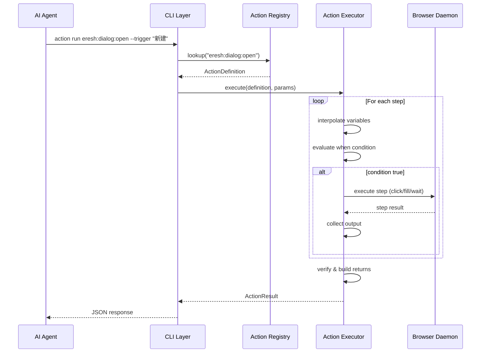
```mermaid
sequenceDiagram
    participant AI as AI Agent
    participant CLI as CLI Layer
    participant Registry as Action Registry
    participant Executor as Action Executor
    participant Browser as Browser Daemon

    AI->>CLI: action run eresh:dialog:open --trigger "新建"
    CLI->>Registry: lookup("eresh:dialog:open")
    Registry-->>CLI: ActionDefinition
    CLI->>Executor: execute(definition, params)
    
    loop For each step
        Executor->>Executor: interpolate variables
        Executor->>Executor: evaluate when condition
        alt condition true
            Executor->>Browser: execute step (click/fill/wait)
            Browser-->>Executor: step result
            Executor->>Executor: collect output
        end
    end
    
    Executor->>Executor: verify & build returns
    Executor-->>CLI: ActionResult
    CLI-->>AI: JSON response
```

#### 4.1.2 应用场景

1. **组件库操作**: Ant Design、Element UI 等复杂组件交互
2. **通用业务流程**: 登录、登出、切换租户
3. **高频固定任务**: 表单填写、报表导出
4. **回归测试**: 预定义操作作为测试步骤

#### 4.1.3 对手分析

| 方案 | 优点 | 缺点 |
|------|------|------|
| 纯 Vision Agent | 直观、无需了解 DOM | 速度慢、抗干扰差 |
| 纯 DOM 解析 | 快速、精确 | 易受改版影响 |
| **本方案** | 语义封装 + 版本管理 | 需要维护操作定义 |

### 4.2 方案选型

| 决策点 | 选型 | 理由 |
|--------|------|------|
| 配置语言 | YAML | 可读性好，支持多行文本 |
| 校验工具 | Zod | TypeScript 原生，类型推导强 |
| 插值引擎 | 自研轻量级 | 避免引入重型模板库的安全风险 |
| 执行环境 | Node.js | 与现有架构一致 |

### 4.3 静态结构

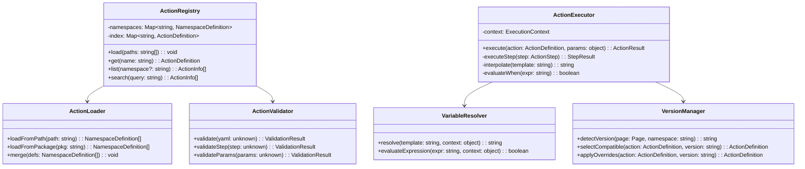
```mermaid
classDiagram
    class ActionRegistry {
        -namespaces: Map~string, NamespaceDefinition~
        -index: Map~string, ActionDefinition~
        +load(paths: string[]): void
        +get(name: string): ActionDefinition
        +list(namespace?: string): ActionInfo[]
        +search(query: string): ActionInfo[]
    }

    class ActionLoader {
        +loadFromPath(path: string): NamespaceDefinition[]
        +loadFromPackage(pkg: string): NamespaceDefinition[]
        +merge(defs: NamespaceDefinition[]): void
    }

    class ActionValidator {
        +validate(yaml: unknown): ValidationResult
        +validateStep(step: unknown): ValidationResult
        +validateParams(params: unknown): ValidationResult
    }

    class ActionExecutor {
        -context: ExecutionContext
        +execute(action: ActionDefinition, params: object): ActionResult
        -executeStep(step: ActionStep): StepResult
        -interpolate(template: string): string
        -evaluateWhen(expr: string): boolean
    }

    class VariableResolver {
        +resolve(template: string, context: object): string
        +evaluateExpression(expr: string, context: object): boolean
    }

    class VersionManager {
        +detectVersion(page: Page, namespace: string): string
        +selectCompatible(action: ActionDefinition, version: string): ActionDefinition
        +applyOverrides(action: ActionDefinition, version: string): ActionDefinition
    }

    ActionRegistry --> ActionLoader
    ActionRegistry --> ActionValidator
    ActionExecutor --> VariableResolver
    ActionExecutor --> VersionManager
```

**目录结构**:

```
src/
├── actions/
│   ├── types.ts          # 核心类型定义
│   ├── registry.ts       # Registry 服务
│   ├── loader.ts         # 文件加载与解析
│   ├── validator.ts      # Schema 校验 (Zod)
│   ├── executor.ts       # 执行引擎
│   ├── vars.ts           # 变量插值与表达式
│   ├── version.ts        # 版本检测与兼容
│   └── selectors.ts      # 选择器管理与降级
└── types.ts              # 扩展 Command 类型
```

### 4.4 概要流程

#### 4.4.1 操作加载流程

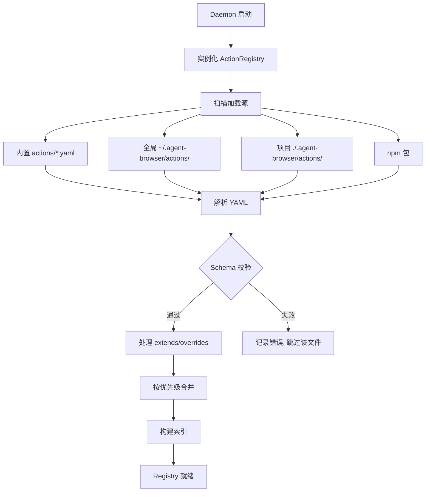
```mermaid
flowchart TD
    A[Daemon 启动] --> B[实例化 ActionRegistry]
    B --> C[扫描加载源]
    
    C --> D1[内置 actions/*.yaml]
    C --> D2["全局 ~/.agent-browser/actions/"]
    C --> D3["项目 ./.agent-browser/actions/"]
    C --> D4[npm 包]
    
    D1 --> E[解析 YAML]
    D2 --> E
    D3 --> E
    D4 --> E
    
    E --> F{Schema 校验}
    F -->|通过| G[处理 extends/overrides]
    F -->|失败| H[记录错误, 跳过该文件]
    
    G --> I[按优先级合并]
    I --> J[构建索引]
    J --> K[Registry 就绪]
```

**加载优先级** (后加载覆盖先加载):
1. 内置操作 (最低)
2. 全局用户操作
3. 项目操作
4. 环境变量指定 (最高)

#### 4.4.2 操作执行流程

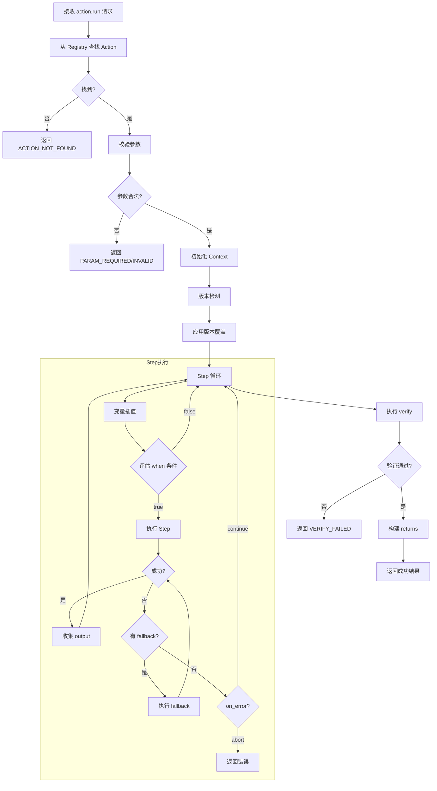
```mermaid
flowchart TD
    A[接收 action.run 请求] --> B[从 Registry 查找 Action]
    B --> C{找到?}
    C -->|否| D[返回 ACTION_NOT_FOUND]
    C -->|是| E[校验参数]
    
    E --> F{参数合法?}
    F -->|否| G[返回 PARAM_REQUIRED/INVALID]
    F -->|是| H[初始化 Context]
    
    H --> I[版本检测]
    I --> J[应用版本覆盖]
    
    J --> K[Step 循环]
    
    subgraph Step执行
        K --> L[变量插值]
        L --> M{评估 when 条件}
        M -->|false| K
        M -->|true| N[执行 Step]
        N --> O{成功?}
        O -->|是| P[收集 output]
        O -->|否| Q{有 fallback?}
        Q -->|是| R[执行 fallback]
        Q -->|否| S{on_error?}
        S -->|continue| K
        S -->|abort| T[返回错误]
        R --> O
        P --> K
    end
    
    K --> U[执行 verify]
    U --> V{验证通过?}
    V -->|否| W[返回 VERIFY_FAILED]
    V -->|是| X[构建 returns]
    X --> Y[返回成功结果]
```

#### 4.4.3 变量插值与表达式求值流程

变量插值与表达式系统是执行引擎的核心子系统，负责将模板字符串中的 `${...}` 占位符替换为实际值，以及对 `when` 条件表达式进行安全求值。

**设计目标**:
- 支持多层级变量引用 (`params.*`, `env.*`, `selectors.*`, `steps.*`)
- 提供安全的表达式求值（禁止代码注入）
- 保持高性能（避免正则回溯）

**变量插值概要流程**:

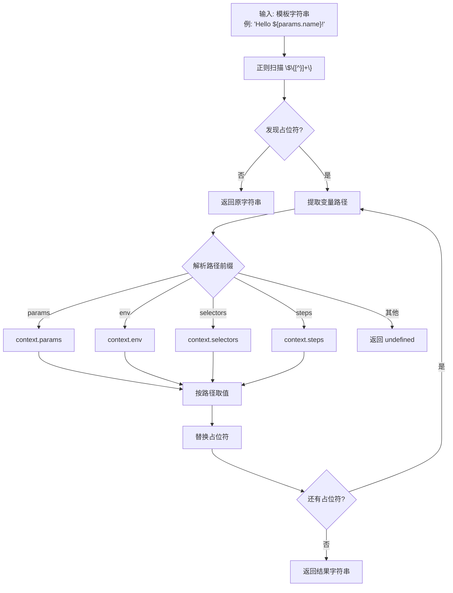
```mermaid
flowchart TD
    A["输入: 模板字符串<br/>例: 'Hello ${params.name}!'"] --> B["正则扫描 \$\{[^}]+\}"]
    B --> C{发现占位符?}
    C -->|否| D[返回原字符串]
    C -->|是| E[提取变量路径]
    
    E --> F{解析路径前缀}
    F -->|params| G[context.params]
    F -->|env| H[context.env]
    F -->|selectors| I[context.selectors]
    F -->|steps| J[context.steps]
    F -->|其他| K[返回 undefined]
    
    G --> L[按路径取值]
    H --> L
    I --> L
    J --> L
    
    L --> M[替换占位符]
    M --> N{还有占位符?}
    N -->|是| E
    N -->|否| O[返回结果字符串]
```

**条件表达式求值概要流程**:

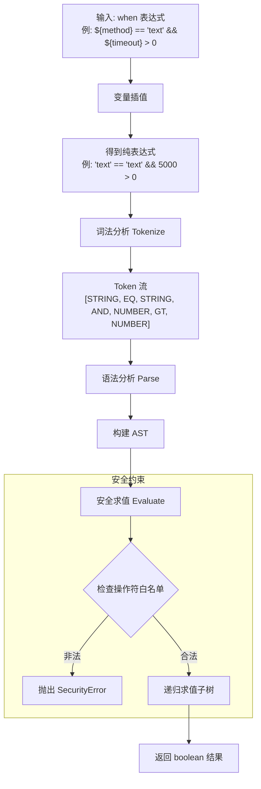
```mermaid
flowchart TD
    A["输入: when 表达式<br/>例: ${method} == 'text' && ${timeout} > 0"] --> B[变量插值]
    B --> C["得到纯表达式<br/>例: 'text' == 'text' && 5000 > 0"]
    
    C --> D[词法分析 Tokenize]
    D --> E["Token 流<br/>[STRING, EQ, STRING, AND, NUMBER, GT, NUMBER]"]
    
    E --> F[语法分析 Parse]
    F --> G[构建 AST]
    
    G --> H[安全求值 Evaluate]
    
    subgraph 安全约束
        H --> I{检查操作符白名单}
        I -->|非法| J[抛出 SecurityError]
        I -->|合法| K[递归求值子树]
    end
    
    K --> L[返回 boolean 结果]
```

**支持的变量作用域**:

| 作用域 | 前缀 | 说明 | 示例 |
|--------|------|------|------|
| 参数 | `params.*` | 调用时传入的参数 | `${params.trigger}` |
| 环境变量 | `env.*` | 系统环境变量 | `${env.TEST_USER}` |
| 选择器 | `selectors.*` | 当前命名空间的选择器别名 | `${selectors.dialog}` |
| 步骤输出 | `steps.*` | 前序步骤的 output | `${steps.findResult.ref}` |

**支持的表达式操作符**:

| 类别 | 操作符 | 说明 |
|------|--------|------|
| 比较 | `==`, `!=`, `>`, `<`, `>=`, `<=` | 值比较 |
| 逻辑 | `&&`, `\|\|`, `!` | 布尔逻辑 |
| 分组 | `(`, `)` | 优先级控制 |

**安全限制**:
- 禁止函数调用
- 禁止对象/数组字面量
- 禁止赋值操作
- 禁止访问 `__proto__`、`constructor` 等危险属性

#### 4.4.4 可调试性机制分析及设计

| 机制 | 实现方式 | 使用场景 |
|------|----------|----------|
| **Dry-Run 模式** | 仅解析参数和流程，不执行实际操作 | 验证配置正确性 |
| **Debug 模式** | 每步输出详细日志 | 排查执行问题 |
| **Step Tracing** | 记录每步的输入、输出、耗时 | 性能分析 |
| **Context Dump** | 出错时输出完整上下文变量 | 快速定位问题 |

**Debug 输出示例**:
```
[DEBUG] Loading action: eresh:dialog:open
[DEBUG] Resolved params: { trigger: "新建", triggerBy: "text" }
[DEBUG] Step 1: find (role:button, name: "新建")
[DEBUG]   Context: { params: {...}, env: {...} }
[DEBUG]   Duration: 120ms
[DEBUG]   Result: Found element @e5
```

#### 4.4.5 可测试性机制分析及设计

| 层级 | 测试类型 | 策略 |
|------|----------|------|
| **Validator** | 单元测试 | 覆盖各种合法/非法 YAML 配置 |
| **VariableResolver** | 单元测试 | 各类插值和表达式场景 |
| **Executor** | 集成测试 | Mock Browser Adapter |
| **E2E** | 端到端测试 | 真实浏览器 + Sample App |

**Mock 设计**:
```typescript
interface BrowserAdapter {
  click(selector: string): Promise<void>;
  fill(selector: string, value: string): Promise<void>;
  // ...
}

// 测试时注入 MockBrowserAdapter
class MockBrowserAdapter implements BrowserAdapter {
  calls: Array<{ method: string; args: unknown[] }> = [];
  async click(selector: string) {
    this.calls.push({ method: 'click', args: [selector] });
  }
  // ...
}
```

#### 4.4.6 可扩展可复用设计

1. **继承机制**: `extends` 关键字支持继承其他定义
2. **Composition**: Action 内部通过 `run` 调用其他 Action
3. **Plugin 架构**: Registry 支持动态注册新的 Action Source
4. **npm 分发**: 操作定义可发布为 npm 包

```yaml
# 继承示例
extends:
  - "@company/ab-actions-eresh"

# 组合示例
steps:
  - action: run
    args:
      action: eresh:dialog:open
      params:
        trigger: "新建"
```

#### 4.4.7 系统隐私设计

| 措施 | 说明 |
|------|------|
| 敏感参数脱敏 | 标记为 `secret: true` 的参数在日志中显示为 `***` |
| 本地优先 | 操作定义文件优先从本地加载，不强制依赖云端 |
| 环境变量隔离 | `${env.*}` 变量不会被记录到日志 |

#### 4.4.8 安全性设计

##### 4.4.8.1 威胁建模分析

| 威胁 | 风险等级 | 说明 |
|------|----------|------|
| 表达式注入 | 高 | 恶意 YAML 通过 `${}` 执行任意代码 |
| 资源耗尽 | 中 | 循环调用或超长等待导致服务不可用 |
| 路径遍历 | 中 | 加载器读取任意文件 |

##### 4.4.8.2 安全设计

###### 4.4.8.2.1 表达式沙箱设计

```typescript
// 严禁使用 eval()
// 使用受限表达式解析器

const ALLOWED_OPERATORS = ['==', '!=', '>', '<', '>=', '<=', '&&', '||', '!'];
const ALLOWED_FUNCTIONS: string[] = []; // 不允许函数调用

function evaluateExpression(expr: string, context: object): boolean {
  // 1. 词法分析，仅允许标识符、字面量、操作符
  // 2. 构建 AST
  // 3. 安全求值
}
```

###### 4.4.8.2.2 资源限制设计

| 限制项 | 默认值 | 说明 |
|--------|--------|------|
| `max_depth` | 10 | 最大递归调用深度 |
| `step_timeout` | 30000ms | 单步超时 |
| `action_timeout` | 300000ms | 整体超时 |
| `max_steps` | 100 | 单个 Action 最大步骤数 |

##### 4.4.8.3 预使用组件版本合规性情况

| 组件 | 版本 | 许可证 | 状态 |
|------|------|--------|------|
| yaml | ^2.3.0 | ISC | 合规 |
| zod | ^3.22.0 | MIT | 合规 |
| semver | ^7.5.0 | ISC | 合规 |

#### 4.4.9 可靠性设计

| 机制 | 实现 |
|------|------|
| **重试** | Step 级别 `retry: N` 配置 |
| **降级** | `fallback` 定义备选路径 |
| **验证** | `verify` 校验操作结果 |
| **超时** | 每个 Step 和 Action 都有超时控制 |

#### 4.4.10 可维护设计

1. **语义化版本**: Action 定义遵循 SemVer
2. **Deprecation**: 支持 `deprecated: true` 标记及替代方案提示
3. **来源追踪**: 每个 Action 记录来源文件路径，便于调试

```yaml
actions:
  dialog:show:
    deprecated: true
    deprecated_message: "请使用 dialog:open"
    alias_of: dialog:open
```

#### 4.4.11 跨平台设计和平台差异处理

| 差异点 | 处理方式 |
|--------|----------|
| 路径分隔符 | 内部统一使用 POSIX 风格，边界处转换 |
| 键盘快捷键 | 提供 `${modifier}` 变量，自动映射 Ctrl/Command |
| 文件编码 | 强制 UTF-8 |

### 4.5 方案风险分析

| 风险 | 影响 | 概率 | 应对策略 |
|------|------|------|----------|
| DOM 结构频繁变更 | 选择器失效 | 高 | 多级 Fallback + 版本映射 |
| 表达式逻辑复杂 | 用户编写困难 | 中 | 限制复杂度 + 文档示例 |
| 性能开销 | 启动变慢 | 低 | 懒加载 + 索引缓存 |
| 命名冲突 | 覆盖意外发生 | 中 | namespace 强制约束 |

---

## 5. 数据结构设计

### 5.1 配置文件定义

#### 5.1.1 全局配置 (~/.agent-browser/config.yaml)

```yaml
actions:
  # 额外加载路径
  paths:
    - "~/.agent-browser/actions"
    - "./.agent-browser/actions"
  
  # npm 包
  packages:
    - "@company/ab-actions-eresh"
    
  # 默认超时 (ms)
  default_timeout: 5000
  
  # 调试模式
  debug: false
  
  # 版本检测
  detect_version: true
```

#### 5.1.2 操作定义文件 Schema

```yaml
# 文件级元数据
namespace: string          # 命名空间 (required)
version: string            # 语义化版本 (required)
description: string        # 描述

# 兼容性声明
compatibility:
  min_version: string
  max_version: string
  version_overrides:
    "<version_pattern>":
      selectors: Record<string, string>

# 选择器别名
selectors:
  <alias>: string | { primary: string, fallback: string[] }

# 操作定义
actions:
  <component>:<action>:
    description: string
    since: string
    deprecated: boolean
    deprecated_message: string
    alias_of: string
    
    params:
      <name>:
        type: string | number | boolean | enum | array | object
        description: string
        required: boolean
        default: any
        values: string[]  # for enum
        secret: boolean   # for sensitive data
        
    steps: ActionStep[]
    returns: Record<string, string>
    verify: VerifyCondition[]
```

### 5.2 全局数据结构定义

#### 5.2.1 核心类型 (src/actions/types.ts)

```typescript
// ============ Registry Types ============

export interface ActionRegistry {
  namespaces: Map<string, NamespaceDefinition>;
  index: Map<string, ActionDefinition>;  // fully qualified name -> definition
}

export interface NamespaceDefinition {
  namespace: string;
  version: string;
  description: string;
  compatibility?: ActionCompatibility;
  selectors: Record<string, SelectorDefinition>;
  actions: Record<string, ActionDefinition>;
  sourcePath: string;  // 来源文件路径
}

// ============ Action Types ============

export interface ActionDefinition {
  name: string;           // e.g., "dialog:open"
  namespace: string;      // e.g., "eresh"
  fullName: string;       // e.g., "eresh:dialog:open"
  description: string;
  since?: string;
  deprecated?: boolean;
  deprecatedMessage?: string;
  aliasOf?: string;
  params: Record<string, ActionParam>;
  steps: ActionStep[];
  returns: Record<string, string>;
  verify?: VerifyCondition[];
  sourcePath: string;
}

export interface ActionParam {
  type: 'string' | 'number' | 'boolean' | 'enum' | 'array' | 'object';
  description: string;
  required: boolean;
  default?: unknown;
  values?: string[];  // for enum type
  secret?: boolean;
}

// ============ Step Types ============

export interface ActionStep {
  action: string;
  args: Record<string, unknown>;
  when?: string;
  output?: string;
  timeout?: number;
  retry?: number;
  retryDelay?: number;  // 重试间隔 (ms)，默认 1000
  onError?: 'continue' | 'abort' | 'fallback';
  fallback?: ActionStep[];
}

// ============ Execution Types ============

export interface ExecutionContext {
  params: Record<string, unknown>;
  env: Record<string, string>;
  selectors: Record<string, string>;
  steps: Record<string, unknown>;  // step outputs
  depth: number;
  
  // 运行时状态
  startTime: number;               // Action 开始时间戳
  actionTimeout: number;           // Action 总超时 (ms)
  stepTimeout: number;             // 单步默认超时 (ms)
  debugMode: boolean;              // 是否调试模式
  dryRun: boolean;                 // 是否干跑模式
}

export interface ActionResult {
  success: boolean;
  data?: Record<string, unknown>;
  error?: ActionError;
}

export interface ActionError {
  code: ActionErrorCode;
  message: string;
  action: string;
  step?: number;
  stepAction?: string;
  details?: Record<string, unknown>;
  suggestion?: string;
}

export type ActionErrorCode =
  | 'ACTION_NOT_FOUND'
  | 'PARAM_REQUIRED'
  | 'PARAM_INVALID'
  | 'ELEMENT_NOT_FOUND'
  | 'TIMEOUT'
  | 'STEP_FAILED'
  | 'VERSION_INCOMPATIBLE'
  | 'VERIFY_FAILED'
  | 'MAX_DEPTH_EXCEEDED';

// ============ Selector Types ============

export type SelectorDefinition = string | {
  primary: string;
  fallback: string[];
};

// ============ Compatibility Types ============

export interface ActionCompatibility {
  minVersion?: string;
  maxVersion?: string;
  versionOverrides?: Record<string, VersionOverride>;
}

export interface VersionOverride {
  selectors?: Record<string, string>;
}

// ============ Verify Types ============

export interface VerifyCondition {
  condition: string;
  message: string;
}
```

---

## 6. 流程设计

### 6.1 Schema 校验器模块 (validator.ts)

本模块负责 YAML 配置文件的结构校验和语义校验，确保操作定义符合规范后才能被加载到 Registry。

#### 6.1.1 模块职责与边界

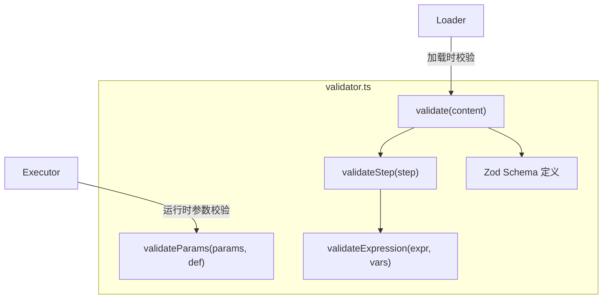
```mermaid
graph TB
    subgraph validator.ts
        validate["validate(content)"]
        validateStep["validateStep(step)"]
        validateParams["validateParams(params, def)"]
        validateExpr["validateExpression(expr, vars)"]
        ZodSchema[Zod Schema 定义]
    end
    
    Loader -->|加载时校验| validate
    Executor -->|运行时参数校验| validateParams
    validate --> ZodSchema
    validate --> validateStep
    validateStep --> validateExpr
```

**模块边界**:
- **输入**: YAML 字符串内容 / 运行时参数对象
- **输出**: ValidationResult { success, errors? }
- **不负责**: YAML 文件的读取、错误的修复

#### 6.1.2 Schema 层级结构

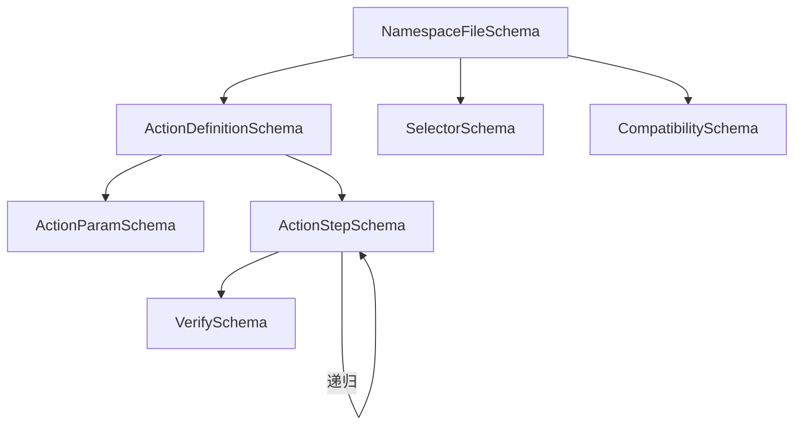
```mermaid
graph TD
    NSF[NamespaceFileSchema] --> AD[ActionDefinitionSchema]
    NSF --> SEL[SelectorSchema]
    NSF --> COMP[CompatibilitySchema]
    AD --> AP[ActionParamSchema]
    AD --> AS[ActionStepSchema]
    AS -->|递归| AS
    AS --> VER[VerifySchema]
```

**各 Schema 职责**:

| Schema | 校验内容 |
|--------|----------|
| `NamespaceFileSchema` | 文件顶层结构: namespace, version, actions |
| `ActionDefinitionSchema` | 单个 Action: description, params, steps, returns |
| `ActionStepSchema` | 单个 Step: action, args, when, fallback (递归) |
| `ActionParamSchema` | 参数定义: type, required, default, values |

#### 6.1.3 完整校验流程

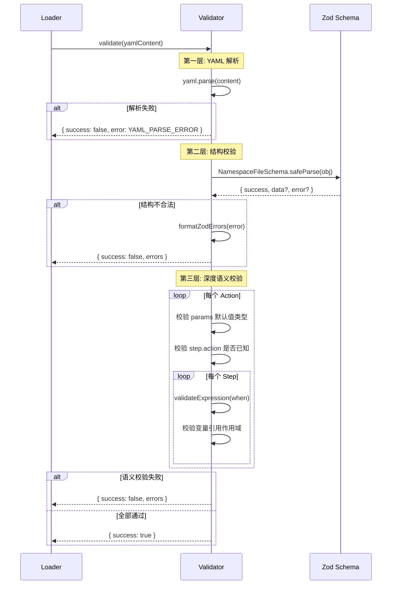
```mermaid
sequenceDiagram
    participant Loader
    participant V as Validator
    participant Zod as Zod Schema
    
    Loader->>V: validate(yamlContent)
    
    Note over V: 第一层: YAML 解析
    V->>V: yaml.parse(content)
    alt 解析失败
        V-->>Loader: { success: false, error: YAML_PARSE_ERROR }
    end
    
    Note over V: 第二层: 结构校验
    V->>Zod: NamespaceFileSchema.safeParse(obj)
    Zod-->>V: { success, data?, error? }
    alt 结构不合法
        V->>V: formatZodErrors(error)
        V-->>Loader: { success: false, errors }
    end
    
    Note over V: 第三层: 深度语义校验
    loop 每个 Action
        V->>V: 校验 params 默认值类型
        V->>V: 校验 step.action 是否已知
        loop 每个 Step
            V->>V: validateExpression(when)
            V->>V: 校验变量引用作用域
        end
    end
    
    alt 语义校验失败
        V-->>Loader: { success: false, errors }
    else 全部通过
        V-->>Loader: { success: true }
    end
```

#### 6.1.4 深度校验详细流程

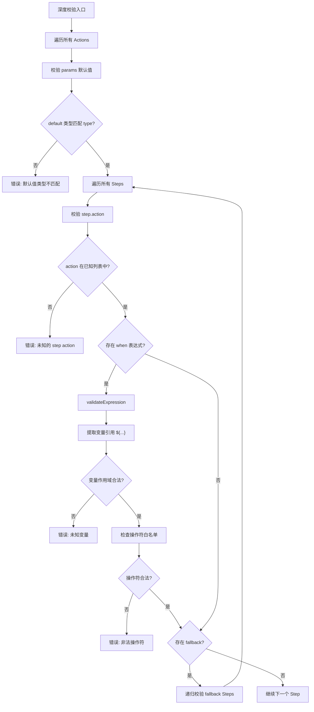
```mermaid
flowchart TD
    A[深度校验入口] --> B[遍历所有 Actions]
    
    B --> C[校验 params 默认值]
    C --> C1{default 类型匹配 type?}
    C1 -->|否| ERR1[错误: 默认值类型不匹配]
    C1 -->|是| D
    
    D[遍历所有 Steps] --> E[校验 step.action]
    E --> E1{action 在已知列表中?}
    E1 -->|否| ERR2[错误: 未知的 step action]
    E1 -->|是| F
    
    F{存在 when 表达式?}
    F -->|是| G[validateExpression]
    G --> G1["提取变量引用 ${...}"]
    G1 --> G2{变量作用域合法?}
    G2 -->|否| ERR3[错误: 未知变量]
    G2 -->|是| G3[检查操作符白名单]
    G3 --> G4{操作符合法?}
    G4 -->|否| ERR4[错误: 非法操作符]
    G4 -->|是| H
    F -->|否| H
    
    H{存在 fallback?}
    H -->|是| I[递归校验 fallback Steps]
    I --> D
    H -->|否| J[继续下一个 Step]
```

#### 6.1.5 表达式校验伪代码

```
function validateExpression(expr, availableVars):
    errors = []
    
    // 1. 提取所有变量引用
    varRefs = 正则匹配 \$\{[^}]+\}
    
    // 2. 检查变量作用域
    for each ref in varRefs:
        path = 去掉 ${ 和 }
        rootScope = path.split('.')[0]
        if rootScope not in ['params', 'env', 'selectors', 'steps']:
            errors.push("Unknown variable scope: " + rootScope)
    
    // 3. 检查操作符白名单
    operators = 正则匹配 [=!<>]+ 或 && 或 ||
    for each op in operators:
        if op not in ALLOWED_OPERATORS:
            errors.push("Invalid operator: " + op)
    
    return errors
```

#### 6.1.6 函数交互总览

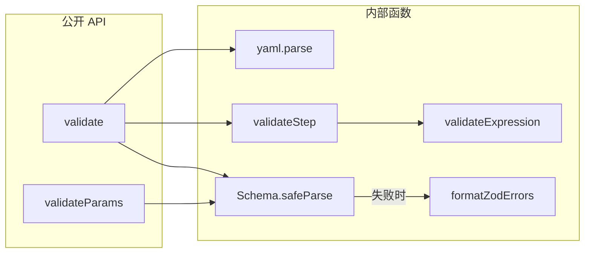
```mermaid
graph LR
    subgraph 公开 API
        validate
        validateParams
    end
    
    subgraph 内部函数
        parseYaml[yaml.parse]
        zodParse[Schema.safeParse]
        validateStep
        validateExpr[validateExpression]
        formatErrors[formatZodErrors]
    end
    
    validate --> parseYaml
    validate --> zodParse
    validate --> validateStep
    validateStep --> validateExpr
    zodParse -->|失败时| formatErrors
    
    validateParams --> zodParse
```

#### 6.1.7 函数列表

| 函数 | 参数 | 返回值 | 职责 |
|------|------|--------|------|
| `validate` | `content: string` | `ValidationResult` | 完整校验 YAML 文件 (解析 + 结构 + 语义) |
| `validateStep` | `step: unknown` | `ValidationResult` | 校验单个 Step 及其 fallback |
| `validateParams` | `params, definition` | `ValidationResult` | 运行时参数校验 (类型 + 必填) |
| `validateExpression` | `expr, vars` | `string[]` | 校验表达式语法和变量引用 |
| `formatZodErrors` | `ZodError` | `string[]` | 将 Zod 错误转为可读信息 |
| `detectCircularFallback` | `steps: ActionStep[]` | `boolean` | 检测 fallback 循环引用 |

#### 6.1.8 循环 Fallback 检测

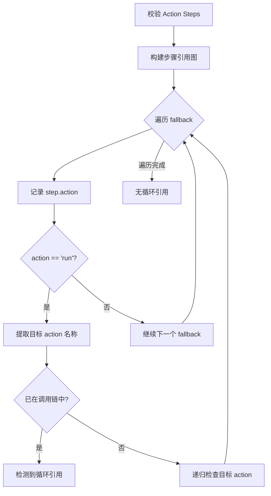
```mermaid
flowchart TD
    A[校验 Action Steps] --> B[构建步骤引用图]
    B --> C{遍历 fallback}
    C --> D[记录 step.action]
    D --> E{action == 'run'?}
    E -->|是| F[提取目标 action 名称]
    F --> G{已在调用链中?}
    G -->|是| H[检测到循环引用]
    G -->|否| I[递归检查目标 action]
    E -->|否| J[继续下一个 fallback]
    I --> C
    J --> C
    C -->|遍历完成| K[无循环引用]
```

**检测逻辑伪代码**:
```
function detectCircularFallback(steps, visited = Set()):
    for each step in steps:
        if step.action == 'run':
            targetAction = step.args.action
            if targetAction in visited:
                return true  // 发现循环
            visited.add(targetAction)
            // 递归检查目标 action 的 steps
        
        if step.fallback:
            if detectCircularFallback(step.fallback, visited):
                return true
    
    return false
```

### 6.2 变量插值与表达式系统 (vars.ts)

> 概要流程见 [4.4.3 变量插值与表达式求值流程](#443-变量插值与表达式求值流程)

本模块负责模板字符串的变量替换和 `when` 条件表达式的安全求值，是执行器的核心依赖。

#### 6.2.1 模块职责与边界

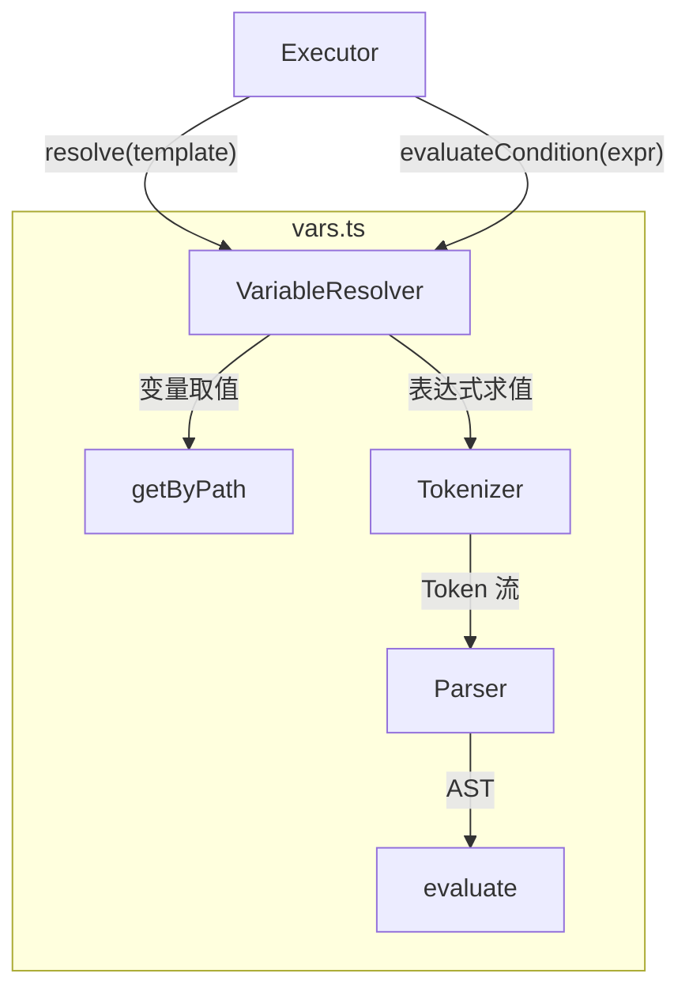
```mermaid
graph TB
    subgraph vars.ts
        VR[VariableResolver]
        GP[getByPath]
        TK[Tokenizer]
        PS[Parser]
        EV[evaluate]
    end
    
    Executor -->|"resolve(template)"| VR
    Executor -->|"evaluateCondition(expr)"| VR
    VR -->|变量取值| GP
    VR -->|表达式求值| TK
    TK -->|Token 流| PS
    PS -->|AST| EV
```

**模块边界**:
- **输入**: 模板字符串 / 条件表达式 + ExecutionContext
- **输出**: 替换后的字符串 / boolean 结果
- **不负责**: 上下文的构建、Step 的执行

#### 6.2.2 变量插值流程

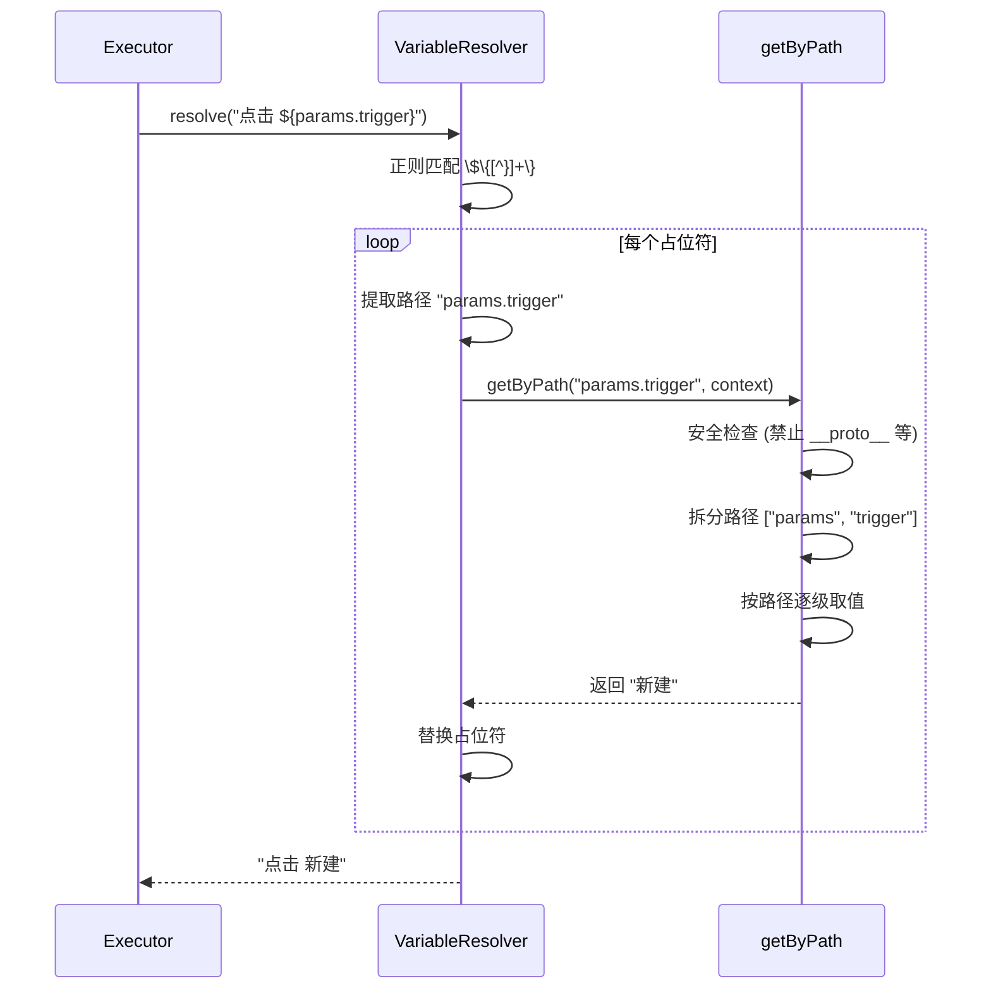
```mermaid
sequenceDiagram
    participant Caller as Executor
    participant VR as VariableResolver
    participant GP as getByPath
    
    Caller->>VR: resolve("点击 ${params.trigger}")
    VR->>VR: 正则匹配 \$\{[^}]+\}
    
    loop 每个占位符
        VR->>VR: 提取路径 "params.trigger"
        VR->>GP: getByPath("params.trigger", context)
        GP->>GP: 安全检查 (禁止 __proto__ 等)
        GP->>GP: 拆分路径 ["params", "trigger"]
        GP->>GP: 按路径逐级取值
        GP-->>VR: 返回 "新建"
        VR->>VR: 替换占位符
    end
    
    VR-->>Caller: "点击 新建"
```

**getByPath 伪代码**:
```
function getByPath(path, context):
    检查 path 是否包含 __proto__ / constructor / prototype
        -> 是: 抛出 SecurityError
    
    parts = path.split('.')
    scope = parts[0]  // params | env | selectors | steps
    
    current = context[scope]
    for each key in parts[1...]:
        if current 为空或非对象: return undefined
        current = current[key]
    
    return current
```

#### 6.2.3 条件表达式求值流程

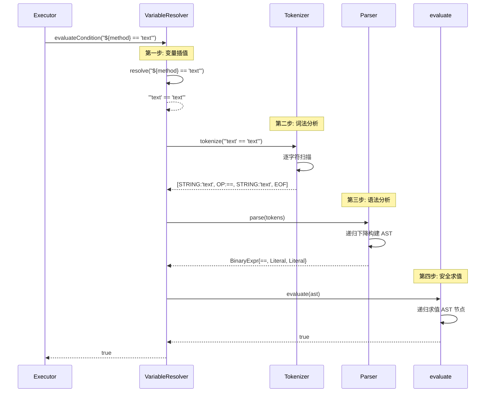
```mermaid
sequenceDiagram
    participant Caller as Executor
    participant VR as VariableResolver
    participant TK as Tokenizer
    participant PS as Parser
    participant EV as evaluate
    
    Caller->>VR: evaluateCondition("${method} == 'text'")
    
    Note over VR: 第一步: 变量插值
    VR->>VR: resolve("${method} == 'text'")
    VR-->>VR: "'text' == 'text'"
    
    Note over TK: 第二步: 词法分析
    VR->>TK: tokenize("'text' == 'text'")
    TK->>TK: 逐字符扫描
    TK-->>VR: [STRING:'text', OP:==, STRING:'text', EOF]
    
    Note over PS: 第三步: 语法分析
    VR->>PS: parse(tokens)
    PS->>PS: 递归下降构建 AST
    PS-->>VR: BinaryExpr{==, Literal, Literal}
    
    Note over EV: 第四步: 安全求值
    VR->>EV: evaluate(ast)
    EV->>EV: 递归求值 AST 节点
    EV-->>VR: true
    
    VR-->>Caller: true
```

#### 6.2.4 词法分析详细流程

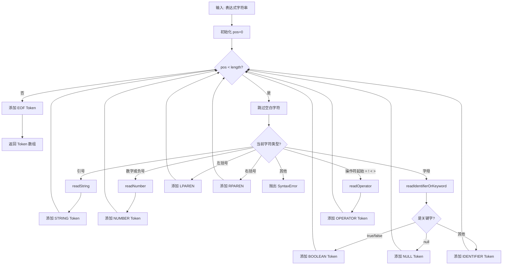
```mermaid
flowchart TD
    A[输入: 表达式字符串] --> B[初始化 pos=0]
    B --> C{pos < length?}
    C -->|否| D[添加 EOF Token]
    D --> E[返回 Token 数组]
    
    C -->|是| F[跳过空白字符]
    F --> G{当前字符类型?}
    
    G -->|引号 | H[readString]
    G -->|数字或负号| I[readNumber]
    G -->|字母| J[readIdentifierOrKeyword]
    G -->|操作符起始 = ! < >| K[readOperator]
    G -->|左括号| L[添加 LPAREN]
    G -->|右括号| M[添加 RPAREN]
    G -->|其他| N[抛出 SyntaxError]
    
    H --> O[添加 STRING Token]
    I --> P[添加 NUMBER Token]
    J --> Q{是关键字?}
    Q -->|true/false| R[添加 BOOLEAN Token]
    Q -->|null| S[添加 NULL Token]
    Q -->|其他| T[添加 IDENTIFIER Token]
    K --> U[添加 OPERATOR Token]
    
    O --> C
    P --> C
    R --> C
    S --> C
    T --> C
    U --> C
    L --> C
    M --> C
```

**Token 类型定义**:
```typescript
type TokenType = 'STRING' | 'NUMBER' | 'BOOLEAN' | 'NULL' 
               | 'IDENTIFIER' | 'OPERATOR' | 'LPAREN' | 'RPAREN' | 'EOF'

interface Token {
  type: TokenType
  value: string | number | boolean | null
  position: number  // 用于错误定位
}
```

#### 6.2.5 语法分析详细流程

采用**递归下降**算法，按操作符优先级从低到高解析：

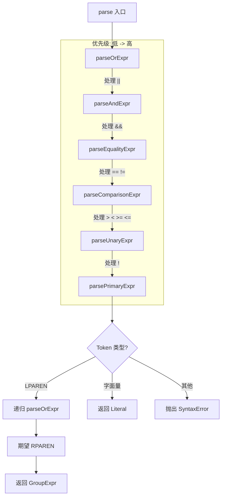
```mermaid
flowchart TD
    A[parse 入口] --> B[parseOrExpr]
    
    subgraph "优先级: 低 -> 高"
        B -->|"处理 ||"| C[parseAndExpr]
        C -->|"处理 &&"| D[parseEqualityExpr]
        D -->|"处理 == !="| E[parseComparisonExpr]
        E -->|"处理 > < >= <="| F[parseUnaryExpr]
        F -->|"处理 !"| G[parsePrimaryExpr]
    end
    
    G --> H{Token 类型?}
    H -->|LPAREN| I[递归 parseOrExpr]
    I --> J[期望 RPAREN]
    J --> K[返回 GroupExpr]
    
    H -->|字面量| L[返回 Literal]
    H -->|其他| M[抛出 SyntaxError]
```

**AST 节点类型**:
```typescript
type ASTNode =
  | { type: 'Literal'; value: string | number | boolean | null }
  | { type: 'UnaryExpr'; operator: '!'; operand: ASTNode }
  | { type: 'BinaryExpr'; operator: BinaryOp; left: ASTNode; right: ASTNode }
  | { type: 'GroupExpr'; expression: ASTNode }

type BinaryOp = '==' | '!=' | '>' | '<' | '>=' | '<=' | '&&' | '||'
```

**解析示例**:
```
输入: "!a && b == 1"

AST:
  BinaryExpr(&&)
  ├── UnaryExpr(!)
  │   └── Literal(a)
  └── BinaryExpr(==)
      ├── Literal(b)
      └── Literal(1)
```

#### 6.2.6 安全求值流程

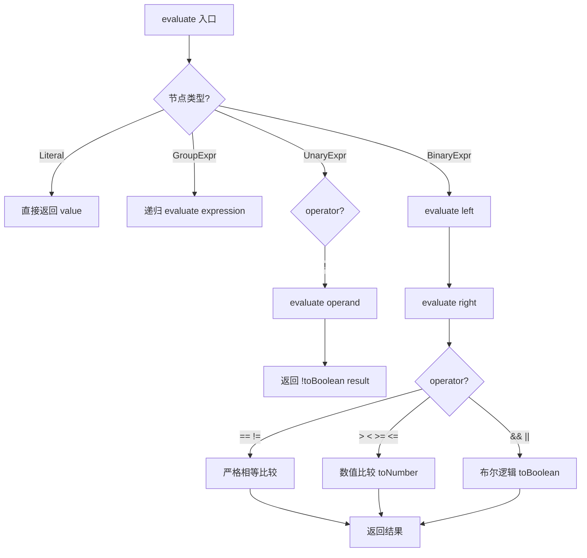
```mermaid
flowchart TD
    A[evaluate 入口] --> B{节点类型?}
    
    B -->|Literal| C[直接返回 value]
    B -->|GroupExpr| D[递归 evaluate expression]
    B -->|UnaryExpr| E{operator?}
    E -->|!| F[evaluate operand]
    F --> G[返回 !toBoolean result]
    
    B -->|BinaryExpr| H[evaluate left]
    H --> I[evaluate right]
    I --> J{operator?}
    
    J -->|== !=| K[严格相等比较]
    J -->|"> < >= <="| L[数值比较 toNumber]
    J -->|"&& ||"| M[布尔逻辑 toBoolean]
    
    K --> N[返回结果]
    L --> N
    M --> N
```

**类型转换规则**:

| 函数 | 输入 | 输出 |
|------|------|------|
| `toBoolean` | 任意值 | `Boolean(value)` |
| `toNumber` | number | 原值 |
| `toNumber` | string | `parseFloat(value) \|\| 0` |
| `toNumber` | 其他 | `0` |

#### 6.2.7 函数交互总览

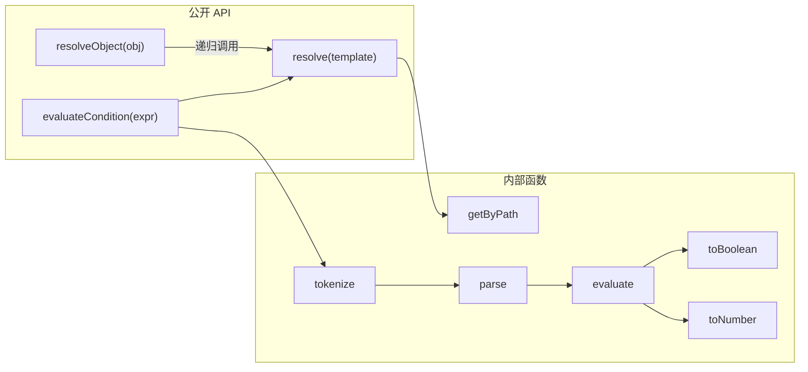
```mermaid
graph LR
    subgraph 公开 API
        resolve["resolve(template)"]
        resolveObject["resolveObject(obj)"]
        evaluateCondition["evaluateCondition(expr)"]
    end
    
    subgraph 内部函数
        getByPath
        tokenize
        parse
        evaluate
        toBoolean
        toNumber
    end
    
    resolve --> getByPath
    resolveObject -->|递归调用| resolve
    evaluateCondition --> resolve
    evaluateCondition --> tokenize
    tokenize --> parse
    parse --> evaluate
    evaluate --> toBoolean
    evaluate --> toNumber
```

#### 6.2.8 函数列表

| 函数 | 参数 | 返回值 | 职责 |
|------|------|--------|------|
| `resolve` | `template: string` | `string` | 替换模板中的 `${...}` 占位符 |
| `resolveObject` | `obj: object` | `object` | 递归解析对象中所有字符串值 |
| `evaluateCondition` | `expr: string` | `boolean` | 完整的条件表达式求值管道 |
| `getByPath` | `path, context` | `unknown` | 按路径安全取值，含安全检查 |
| `tokenize` | `input: string` | `Token[]` | 将字符串拆分为 Token 序列 |
| `parse` | `tokens: Token[]` | `ASTNode` | 递归下降构建 AST |
| `evaluate` | `node: ASTNode` | `unknown` | 递归求值 AST，返回最终结果 |

#### 6.2.9 安全设计检查清单

| 检查项 | 实现方式 | 状态 |
|--------|----------|------|
| 禁用 `eval()` | 使用自研 Tokenizer + Parser | [x] |
| 操作符白名单 | 仅允许 `== != > < >= <= && \|\| !` | [x] |
| 禁止函数调用 | Tokenizer 不产生函数调用 Token | [x] |
| 原型链防护 | `getByPath` 拒绝危险属性 | [x] |
| 递归深度限制 | AST 深度超过 50 时报错 | [x] |
| 错误可定位 | Token 携带 position 字段 | [x] |

### 6.3 执行器模块 (executor.ts)

本模块是 Action 系统的核心，负责按照 ActionDefinition 执行 Steps，协调 Browser、VariableResolver、VersionManager 等子模块。

#### 6.3.1 模块职责与依赖

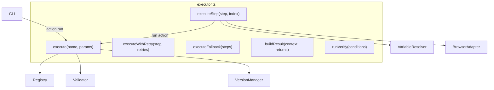
```mermaid
graph TB
    subgraph executor.ts
        execute["execute(name, params)"]
        executeStep["executeStep(step, index)"]
        executeWithRetry["executeWithRetry(step, retries)"]
        executeFallback["executeFallback(steps)"]
        buildResult["buildResult(context, returns)"]
        runVerify["runVerify(conditions)"]
    end
    
    CLI -->|action.run| execute
    execute --> Registry
    execute --> Validator
    execute --> VersionManager
    executeStep --> VariableResolver
    executeStep --> BrowserAdapter
    executeStep -->|run action| execute
```

**模块边界**:
- **输入**: Action 名称 + 参数对象
- **输出**: ActionResult { success, data?, error? }
- **依赖**: Registry (查找 Action)、VariableResolver (插值)、BrowserAdapter (执行)

#### 6.3.2 主执行流程

> 概要流程见 [4.4.2 操作执行流程](#442-操作执行流程)

```mermaid
sequenceDiagram
    participant CLI
    participant E as Executor
    participant R as Registry
    participant V as Validator
    participant VR as VariableResolver
    participant VM as VersionManager
    participant B as Browser
    
    CLI->>E: execute("eresh:dialog:open", { trigger: "新建" })
    
    Note over E: 阶段1: 查找与校验
    E->>R: get("eresh:dialog:open")
    R-->>E: ActionDefinition
    E->>V: validateParams(params, definition)
    alt 参数不合法
        E-->>CLI: { success: false, error: PARAM_INVALID }
    end
    
    Note over E: 阶段2: 初始化上下文
    E->>E: 构建 ExecutionContext
    E->>VM: detectVersion(page, namespace)
    VM-->>E: "4.x"
    E->>VM: applyOverrides(action, "4.x")
    VM-->>E: 版本适配后的 ActionDefinition
    E->>VR: new VariableResolver(context)
    
    Note over E: 阶段3: 执行 Steps
    loop 每个 Step
        E->>E: executeStep(step, index)
    end
    
    Note over E: 阶段4: 验证与返回
    E->>E: runVerify(action.verify)
    E->>E: buildResult(context, action.returns)
    E-->>CLI: ActionResult
```

#### 6.3.3 单步执行流程

```mermaid
sequenceDiagram
    participant E as Executor
    participant VR as VariableResolver
    participant B as Browser
    
    E->>E: executeStep(step, index)
    
    Note over E,VR: 1. 变量插值
    E->>VR: resolveObject(step.args)
    VR-->>E: 解析后的 args
    
    Note over E,VR: 2. 条件判断
    alt step.when 存在
        E->>VR: evaluateCondition(step.when)
        VR-->>E: boolean
        alt 条件为 false
            E-->>E: 跳过此步骤
        end
    end
    
    Note over E,B: 3. 执行操作
    E->>E: mapStepToCommand(step)
    
    alt step.action == 'run'
        E->>E: execute(args.action, args.params)  // 递归
    else 其他 action
        E->>B: 执行对应浏览器操作
        B-->>E: 操作结果
    end
    
    alt 执行失败
        alt step.retry > 0
            E->>E: executeWithRetry(step, retry-1)
        else step.fallback 存在
            E->>E: executeFallback(step.fallback)
        else step.onError == 'continue'
            E-->>E: 记录错误，继续
        else
            E-->>E: 抛出错误，中止
        end
    end
    
    Note over E: 4. 收集输出
    alt step.output 存在
        E->>E: context.steps[output] = result
    end
```

#### 6.3.4 重试与降级流程

```mermaid
flowchart TD
    A[executeStep 失败] --> B{retry > 0?}
    B -->|是| C[等待间隔]
    C --> D[executeWithRetry retry-1]
    D --> E{成功?}
    E -->|是| F[返回成功]
    E -->|否| B
    
    B -->|否| G{有 fallback?}
    G -->|是| H[executeFallback]
    H --> I{fallback 成功?}
    I -->|是| F
    I -->|否| J{onError 策略}
    
    G -->|否| J
    J -->|continue| K[记录错误继续下一步]
    J -->|abort| L[抛出 ActionError 中止]
```

#### 6.3.5 Step Action 映射

```mermaid
flowchart LR
    SA[step.action] --> M{映射}
    M -->|click| B1["browser.click selector"]
    M -->|fill| B2["browser.fill selector, value"]
    M -->|type| B3["browser.type selector, text"]
    M -->|press| B4["browser.press key"]
    M -->|wait| B5["browser.wait condition, timeout"]
    M -->|snapshot| B6["browser.snapshot"]
    M -->|find| B7["browser.find semanticQuery"]
    M -->|eval| B8["browser.evaluate script"]
    M -->|open| B9["browser.navigate url"]
    M -->|run| E["executor.execute 递归调用"]
    M -->|fail| ERR["throw ActionError"]
```

| Step Action | 映射到 | 参数说明 |
|-------------|--------|----------|
| `click` | browser.click() | selector: 元素选择器 |
| `fill` | browser.fill() | selector, value: 填充值 |
| `type` | browser.type() | selector, text: 逐字输入 |
| `press` | browser.press() | key: 按键名称 |
| `wait` | browser.wait() | condition, timeout |
| `snapshot` | browser.snapshot() | 无参数，返回页面快照 |
| `find` | browser.find() | query: 语义化查询 |
| `eval` | browser.evaluate() | script: JS 代码 |
| `open` | browser.navigate() | url: 目标地址 |
| `run` | executor.execute() | action, params: 递归调用其他 Action |
| `fail` | throw ActionError | message: 主动失败 |

#### 6.3.6 函数交互总览

```mermaid
graph LR
    subgraph 公开 API
        execute
    end
    
    subgraph 内部函数
        executeStep
        executeWithRetry
        executeFallback
        mapStepToCommand
        buildResult
        runVerify
    end
    
    execute --> executeStep
    executeStep --> mapStepToCommand
    executeStep -->|失败| executeWithRetry
    executeWithRetry -->|仍失败| executeFallback
    executeStep -->|run action| execute
    execute --> runVerify
    execute --> buildResult
```

#### 6.3.7 函数列表

| 函数 | 参数 | 返回值 | 职责 |
|------|------|--------|------|
| `execute` | `actionName, params` | `ActionResult` | 完整执行一个 Action |
| `executeStep` | `step, index` | `StepResult` | 执行单个 Step (含插值、条件判断) |
| `executeWithRetry` | `step, retriesLeft` | `StepResult` | 带重试的 Step 执行 |
| `executeFallback` | `fallbackSteps` | `StepResult` | 执行降级步骤序列 |
| `mapStepToCommand` | `step` | `BrowserCommand` | 将 Step 映射为浏览器命令 |
| `buildResult` | `context, returns` | `ActionResult` | 从上下文构建返回值 |
| `runVerify` | `conditions` | `VerifyResult` | 执行验证条件列表 |

#### 6.3.8 递归调用深度控制

```mermaid
flowchart TD
    A[execute 入口] --> B{context.depth >= MAX_DEPTH?}
    B -->|是| C[抛出 MAX_DEPTH_EXCEEDED]
    B -->|否| D[context.depth++]
    D --> E[执行 Steps]
    E --> F[context.depth--]
    F --> G[返回结果]
```

**伪代码**:
```
async function execute(actionName, params):
    if context.depth >= MAX_DEPTH (10):
        throw MAX_DEPTH_EXCEEDED
    
    context.depth++
    try:
        // ... 执行逻辑
    finally:
        context.depth--
```

### 6.4 加载器模块 (loader.ts)

本模块负责从多个来源加载 YAML 定义文件，处理继承关系，并按优先级合并到 Registry。

#### 6.4.1 模块职责与边界

```mermaid
graph TB
    subgraph loader.ts
        loadFromPath["loadFromPath(path)"]
        loadFromPackage["loadFromPackage(pkg)"]
        merge["merge(definitions)"]
        resolveExtends["resolveExtends(def)"]
    end
    
    Registry -->|启动时| loadFromPath
    Registry -->|启动时| loadFromPackage
    loadFromPath --> Validator
    loadFromPackage --> Validator
    merge --> Registry
    resolveExtends --> merge
```

**模块边界**:
- **输入**: 文件路径 / npm 包名
- **输出**: NamespaceDefinition[]
- **不负责**: YAML 内容校验 (委托给 Validator)、文件系统抽象

#### 6.4.2 多源加载流程

```mermaid
sequenceDiagram
    participant R as Registry
    participant L as Loader
    participant FS as FileSystem
    participant V as Validator
    
    R->>L: loadAll(config)
    
    Note over L: 阶段1: 收集所有来源
    L->>L: 解析加载优先级
    
    par 并行加载
        L->>FS: 扫描 内置 actions/*.yaml
        L->>FS: 扫描 ~/.agent-browser/actions/
        L->>FS: 扫描 ./.agent-browser/actions/
        L->>L: 解析 npm 包 (require.resolve)
    end
    
    Note over L: 阶段2: 逐文件处理
    loop 每个 YAML 文件
        L->>FS: readFile(path)
        FS-->>L: content
        L->>V: validate(content)
        alt 校验失败
            L->>L: 记录错误，跳过
        else 校验成功
            L->>L: 解析为 NamespaceDefinition
        end
    end
    
    Note over L: 阶段3: 处理继承与合并
    L->>L: resolveExtends(definitions)
    L->>L: merge(definitions) 按优先级
    
    L-->>R: NamespaceDefinition[]
```

#### 6.4.3 继承解析流程

```mermaid
flowchart TD
    A[输入: 定义列表] --> B{遍历每个定义}
    B --> C{有 extends?}
    C -->|否| D[保持原样]
    C -->|是| E[解析 extends 列表]
    
    E --> F{遍历每个父定义}
    F --> G{父定义已加载?}
    G -->|否| H[尝试从 npm 加载]
    H --> I{加载成功?}
    I -->|否| ERR[错误: 找不到父定义]
    I -->|是| J
    G -->|是| J[获取父定义]
    
    J --> K[深度合并]
    K --> L{还有更多父定义?}
    L -->|是| F
    L -->|否| M[返回合并后的定义]
    
    D --> N[继续下一个]
    M --> N
    N --> B
    B -->|遍历完成| O[返回处理后的列表]
```

**深度合并规则**:

| 字段 | 合并策略 |
|------|----------|
| `namespace` | 子定义覆盖 |
| `version` | 子定义覆盖 |
| `selectors` | 浅合并 (子覆盖父) |
| `actions` | 深合并 (按 action 名合并) |
| `compatibility` | 深合并 |

#### 6.4.4 函数列表

| 函数 | 参数 | 返回值 | 职责 |
|------|------|--------|------|
| `loadAll` | `config: LoaderConfig` | `NamespaceDefinition[]` | 从所有来源加载定义 |
| `loadFromPath` | `path: string` | `NamespaceDefinition[]` | 从目录加载 YAML 文件 |
| `loadFromPackage` | `pkg: string` | `NamespaceDefinition[]` | 从 npm 包加载 |
| `resolveExtends` | `defs: NamespaceDefinition[]` | `NamespaceDefinition[]` | 解析继承关系 |
| `merge` | `defs: NamespaceDefinition[]` | `NamespaceDefinition[]` | 按优先级合并同名定义 |
| `deepMerge` | `parent, child` | `object` | 深度合并两个定义对象 |

### 6.5 版本管理器模块 (version.ts)

本模块负责检测目标页面的组件库版本，并根据版本应用对应的选择器覆盖配置。

#### 6.5.1 模块职责与边界

```mermaid
graph TB
    subgraph version.ts
        detectVersion["detectVersion(page, namespace)"]
        selectCompatible["selectCompatible(action, version)"]
        applyOverrides["applyOverrides(action, version)"]
    end
    
    Executor -->|执行前| detectVersion
    Executor -->|执行前| applyOverrides
    detectVersion --> Browser
    applyOverrides --> Action
```

**模块边界**:
- **输入**: Page 对象 / ActionDefinition / 版本字符串
- **输出**: 检测到的版本 / 适配后的 ActionDefinition
- **不负责**: 页面操作、选择器实际执行

#### 6.5.2 版本检测流程

```mermaid
sequenceDiagram
    participant E as Executor
    participant VM as VersionManager
    participant B as Browser
    
    E->>VM: detectVersion(page, "eresh")
    
    VM->>VM: 获取 namespace 的版本检测配置
    
    alt 配置了 version_selector
        VM->>B: evaluate(version_selector)
        B-->>VM: "4.2.1"
    else 配置了 version_script
        VM->>B: evaluate(version_script)
        B-->>VM: "4.2.1"
    else 配置了 version_meta
        VM->>B: 查询 meta 标签
        B-->>VM: "4.2.1"
    else 无配置
        VM-->>E: null (使用默认)
    end
    
    VM->>VM: 规范化版本号 (semver.coerce)
    VM-->>E: "4.2.1"
```

#### 6.5.3 版本覆盖应用流程

```mermaid
flowchart TD
    A[输入: action, 检测到的版本] --> B{版本存在?}
    B -->|否| C[返回原 action]
    B -->|是| D[获取 compatibility.version_overrides]
    
    D --> E{遍历 override 规则}
    E --> F{版本匹配 pattern?}
    F -->|否| E
    F -->|是| G[收集匹配的 override]
    G --> E
    
    E -->|遍历完成| H{有匹配的 override?}
    H -->|否| C
    H -->|是| I[合并所有匹配的 selectors]
    
    I --> J[克隆 action]
    J --> K[覆盖 action 中的 selectors 引用]
    K --> L[返回适配后的 action]
```

**版本匹配规则**:

| Pattern | 说明 | 示例匹配 |
|---------|------|----------|
| `4.x` | 主版本匹配 | 4.0.0, 4.5.2 |
| `>=4.2.0` | semver 范围 | 4.2.0, 4.3.1, 5.0.0 |
| `~4.2.0` | 补丁版本兼容 | 4.2.0, 4.2.5 |
| `^4.2.0` | 次版本兼容 | 4.2.0, 4.9.0 |

#### 6.5.4 函数列表

| 函数 | 参数 | 返回值 | 职责 |
|------|------|--------|------|
| `detectVersion` | `page, namespace` | `string \| null` | 检测页面组件库版本 |
| `selectCompatible` | `action, version` | `ActionDefinition` | 选择兼容版本的 action |
| `applyOverrides` | `action, version` | `ActionDefinition` | 应用版本特定的选择器覆盖 |
| `matchVersion` | `version, pattern` | `boolean` | 检查版本是否匹配 pattern |

### 6.6 选择器管理模块 (selectors.ts)

本模块负责选择器的解析、降级和缓存，提供多策略的元素定位能力。

#### 6.6.1 模块职责与边界

```mermaid
graph TB
    subgraph selectors.ts
        resolve["resolve(selectorDef)"]
        tryFallback["tryFallback(fallbacks)"]
        cache["SelectorCache"]
    end
    
    Executor -->|执行 Step| resolve
    resolve -->|主选择器失败| tryFallback
    resolve --> cache
```

**模块边界**:
- **输入**: SelectorDefinition (字符串或含 fallback 的对象)
- **输出**: 解析后可用的选择器字符串
- **不负责**: 实际的元素查找 (委托给 Browser)

#### 6.6.2 选择器解析与降级流程

```mermaid
sequenceDiagram
    participant E as Executor
    participant SM as SelectorManager
    participant B as Browser
    participant Cache as SelectorCache
    
    E->>SM: resolve(selectorDef)
    
    SM->>Cache: get(selectorKey)
    alt 缓存命中
        Cache-->>SM: cachedSelector
        SM-->>E: cachedSelector
    else 缓存未命中
        SM->>SM: 解析 SelectorDefinition
        
        alt 简单字符串
            SM-->>E: selector
        else 含 fallback 对象
            SM->>B: 尝试 primary selector
            alt primary 成功
                B-->>SM: element found
                SM->>Cache: set(selectorKey, primary)
                SM-->>E: primary
            else primary 失败
                SM->>SM: tryFallback(fallbacks)
                loop 遍历 fallback
                    SM->>B: 尝试 fallback[i]
                    alt 成功
                        B-->>SM: element found
                        SM->>Cache: set(selectorKey, fallback[i])
                        SM-->>E: fallback[i]
                    end
                end
                SM-->>E: 抛出 ELEMENT_NOT_FOUND
            end
        end
    end
```

#### 6.6.3 选择器类型支持

```mermaid
flowchart LR
    S[Selector 字符串] --> P{前缀解析}
    
    P -->|css:| CSS["CSS Selector<br/>css:.ant-btn-primary"]
    P -->|xpath:| XP["XPath<br/>xpath://button[@type='submit']"]
    P -->|role:| ROLE["ARIA Role<br/>role:button[name='Submit']"]
    P -->|text:| TEXT["Text Content<br/>text:提交"]
    P -->|testid:| TID["Test ID<br/>testid:submit-btn"]
    P -->|无前缀| AUTO["自动检测<br/>(默认 CSS)"]
```

| 前缀 | 类型 | 说明 |
|------|------|------|
| `css:` | CSS Selector | 标准 CSS 选择器 |
| `xpath:` | XPath | XPath 表达式 |
| `role:` | ARIA Role | 按角色和可访问名称定位 |
| `text:` | Text Content | 按文本内容匹配 |
| `testid:` | Test ID | 按 data-testid 属性 |
| (无) | Auto | 自动检测，默认为 CSS |

#### 6.6.4 缓存策略

```mermaid
flowchart TD
    A[选择器解析成功] --> B[生成缓存 Key]
    B --> C["Key = namespace + action + step + selectorAlias"]
    C --> D[存入 LRU Cache]
    
    E[下次解析] --> F{缓存命中?}
    F -->|是| G[直接使用缓存值]
    F -->|否| H[重新解析]
    
    I[页面导航] --> J[清除当前页面相关缓存]
    K[action reload] --> L[清除所有缓存]
```

**缓存配置**:
- 最大缓存条目: 1000
- 缓存失效策略: LRU (最近最少使用)
- 自动失效: 页面导航时清除

#### 6.6.5 函数列表

| 函数 | 参数 | 返回值 | 职责 |
|------|------|--------|------|
| `resolve` | `selectorDef, context` | `string` | 解析选择器定义，处理降级 |
| `tryFallback` | `fallbacks: string[]` | `string` | 依次尝试 fallback 列表 |
| `parseSelector` | `selector: string` | `ParsedSelector` | 解析选择器类型和值 |
| `clearCache` | `scope?: string` | `void` | 清除选择器缓存 |

---

## 7. 总结

### 7.1 关联分析

```mermaid
graph LR
    subgraph agent-browser
        CLI[CLI Layer]
        Daemon[Daemon]
        Browser[Browser Module]
        Snapshot[Snapshot Module]
    end
    
    subgraph Action Registry
        Registry[Registry]
        Loader[Loader]
        Validator[Validator]
        Executor[Executor]
        Vars[Variable Resolver]
        Version[Version Manager]
    end
    
    CLI --> Registry
    CLI --> Executor
    Executor --> Browser
    Executor --> Snapshot
    Executor --> Vars
    Executor --> Version
    Loader --> Validator
    Loader --> Registry
```

**依赖关系**:
- Action Registry 强依赖 Browser Module（执行底层操作）
- Action Registry 可选依赖 Snapshot Module（获取页面状态）
- CLI 通过 Daemon 协议调用 Action Registry

### 7.2 遗留问题解决

| 问题 | 状态 | 解决方案 |
|------|------|----------|
| 复杂循环逻辑 | 待定 | 后续版本引入 JS Hook 文件支持 |
| 动态参数类型 | 待定 | 考虑支持 TypeScript 类型表达式 |
| 热更新定义 | 已规划 | `action reload` 命令 |

---

## 8. 业务逻辑相关的测试用例

### 8.1 Schema 校验测试

| 用例 | 输入 | 期望结果 |
|------|------|----------|
| 合法完整定义 | 完整 YAML | success: true |
| 缺少 namespace | 无 namespace 字段 | error: namespace required |
| 非法 param type | type: "invalid" | error: invalid enum value |
| 循环 fallback | fallback 引用自身 | error: circular reference |

### 8.2 变量插值测试

| 用例 | 模板 | Context | 期望结果 |
|------|------|---------|----------|
| 简单替换 | `${params.name}` | `{params:{name:"test"}}` | `"test"` |
| 嵌套路径 | `${params.user.name}` | `{params:{user:{name:"alice"}}}` | `"alice"` |
| 不存在变量 | `${params.unknown}` | `{params:{}}` | `""` (空字符串) |
| 混合文本 | `Hello ${params.name}!` | `{params:{name:"world"}}` | `"Hello world!"` |
| 危险属性 | `${params.__proto__}` | `{params:{}}` | 抛出 SecurityError |

### 8.3 条件表达式测试

| 用例 | 表达式 | Context | 期望结果 |
|------|--------|---------|----------|
| 相等比较 | `${x} == 1` | `{x:1}` | `true` |
| 不等比较 | `${x} != 1` | `{x:2}` | `true` |
| 逻辑与 | `${a} && ${b}` | `{a:true,b:false}` | `false` |
| 字符串比较 | `${s} == 'hello'` | `{s:"hello"}` | `true` |

### 8.4 执行器测试

| 用例 | 操作 | 期望行为 |
|------|------|----------|
| 正常执行 | dialog:open | 按序执行所有 steps |
| 条件跳过 | when: false | 跳过该 step |
| 重试成功 | retry: 2, 第2次成功 | 成功，无错误 |
| 降级成功 | primary 失败, fallback 成功 | 成功，记录降级 |
| 最大深度 | 递归超过 10 层 | MAX_DEPTH_EXCEEDED |

---

## 9. 变更控制

### 9.1 变更列表

| 版本 | 日期 | 变更内容 | 作者 |
|------|------|----------|------|
| v1.0 | 2026-01-15 | 初始设计 | - |
| v2.0 | 2026-01-15 | 重构为概要设计规范，补充技术细节 | - |
| v2.1 | 2026-01-15 | 设计检视修订：补充 Loader/VersionManager/SelectorManager 模块流程设计；修复 API 接口缺少 dryRun/debug 命令；补充 ExecutionContext 运行时字段；增加循环 fallback 检测逻辑；补充 retryDelay 配置 | - |
